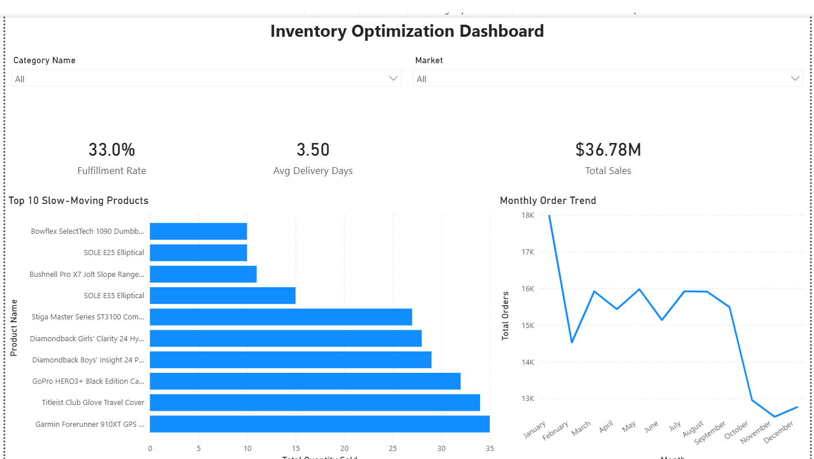

# Inventory Optimization Dashboard — Power BI

**Project 2 of my Supply Chain Analyst Portfolio**

An interactive Power BI dashboard built on the DataCo Smart Supply Chain dataset (180,519 rows) to analyze inventory performance, identify slow-moving products, and track order fulfillment trends.

---

## Dashboard Preview



---

## Business Questions Answered

- Which products are slow-moving and tying up inventory capital?
- What is our overall order fulfillment rate?
- How many days on average does it take to ship an order?
- How does order volume trend across the year by category and market?

---

## Key Metrics

| KPI | Value |
|-----|-------|
| Total Sales | $36.78M |
| Order Fulfillment Rate | 33.0% |
| Average Delivery Days | 3.50 days |
| Total Orders Analyzed | 180,519 rows |

---

## Dashboard Features

**KPI Cards**
- Total Sales, Fulfillment Rate, and Average Delivery Days displayed as headline metrics at the top of the dashboard

**Top 10 Slow-Moving Products (Bar Chart)**
- Horizontal bar chart filtered to bottom 10 products by quantity sold
- Identifies high-risk inventory items that may require reorder quantity adjustments
- Notable slow movers: SOLE E25 Elliptical, SOLE E35 Elliptical, Bowflex SelectTech 1090 Dumbbells (~10 units each)

**Monthly Order Trend (Line Chart)**
- Order volume plotted month by month across the full dataset period
- Reveals a January peak (~18K orders) followed by stabilization (~15–16K) and a Q4 decline
- The October–December drop warrants further investigation: potential data truncation, seasonal demand shift, or fulfillment bottleneck

**Interactive Slicers**
- Category Name dropdown — filters all visuals by product category
- Market dropdown — filters all visuals by region (Europe, LATAM, Pacific Asia, USCA, Africa)

---

## DAX Measures Written

```dax
Total Sales = SUM(SupplyChain[Sales])

Total Orders = COUNTROWS(SupplyChain)

Total Quantity Sold = SUM(SupplyChain[Order Item Quantity])

Fulfillment Rate =
DIVIDE(
    COUNTROWS(FILTER(SupplyChain, SupplyChain[Order Status] = "COMPLETE")),
    COUNTROWS(SupplyChain),
    0
)

Avg Delivery Days =
AVERAGEX(
    SupplyChain,
    DATEDIFF(SupplyChain[Order Date], SupplyChain[Shipping Date], DAY)
)
```

---

## Key Business Insights

**Slow-moving inventory risk**
Elliptical machines and high-end fitness equipment (SOLE E25, E35, Bowflex) show the lowest sales velocity at ~10 units. As a Purchasing Specialist, this signals a need to reduce reorder quantities or renegotiate supplier minimums for these SKUs.

**Fulfillment rate of 33%**
Only 33% of orders carry a "COMPLETE" status in the dataset. This reflects the multi-stage order lifecycle in the DataCo dataset (Pending, Processing, Shipped, On Hold, Canceled) rather than a true failure rate — but it highlights the importance of tracking order status distribution as a supply chain KPI.

**Average 3.5-day delivery**
A 3.5-day average from order to ship is a solid baseline. Filtering by Market reveals whether specific regions underperform this average — a natural next analysis.

**Q4 order volume decline**
Order volume drops sharply from October through December. This pattern would prompt a supply chain analyst to investigate whether this is seasonal demand reduction, a data completeness issue, or a capacity constraint entering Q4.

---

## Dataset

**DataCo Smart Supply Chain Dataset**
- Source: Kaggle — DataCo Global
- Rows: 180,519 orders
- Fields include: Order Date, Shipping Date, Product Name, Category, Market, Sales, Order Status, Order Item Quantity, Profit Ratio

---

## Tools Used

| Tool | Purpose |
|------|---------|
| Power BI Desktop | Dashboard development |
| DAX | KPI measure calculation |
| Power Query | Data loading and type validation |
| PostgreSQL | Prior SQL analysis (see Project 1) |

---

## Related Projects

- **Project 1 — SQL Supply Chain Analysis**: 12 business queries on the same DataCo dataset using PostgreSQL → [View on GitHub](#)

---

## About Me

Purchasing Specialist transitioning into Supply Chain Analytics. Building a portfolio of end-to-end supply chain projects using SQL, Power BI, and Python.

[LinkedIn](#) | [GitHub](#)ng DataCo Supply Chain dataset (180,519 rows)
